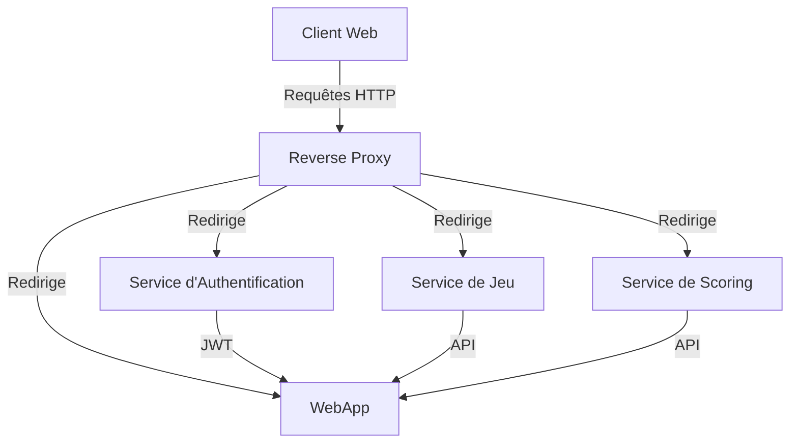

# Documentation

Le projet MNOITCUOS est un jeu inspiré de MOTUS, dans lequel les joueurs doivent trouver un mot mystère en un nombre limité de tentatives. Ce document vise à fournir une vue d'ensemble complète du projet, y compris son état actuel, son architecture, comment le démarrer, et les prochaines étapes potentielles pour son évolution.

## État du Projet

Le projet en est à sa phase initiale mais fonctionnelle. Il comprend plusieurs microservices qui gèrent différents aspects du jeu, comme l'authentification des utilisateurs, le jeu lui-même, et la gestion des scores.

## Architecture du Projet

Le projet est divisé en plusieurs microservices, chacun ayant son propre rôle :

- **Service d'Authentification** : Gère l'authentification et la session des utilisateurs.
- **Service de Jeu** : Contient la logique du jeu MOTUS.
- **Service de Scoring** : Enregistre et récupère les scores des utilisateurs.
- **WebApp** : Fournit l'interface utilisateur pour interagir avec le jeu.

### Diagramme d'Architecture



## Comment Démarrer le Projet

### Prérequis

- Docker et Docker Compose installés sur votre machine.

### Instructions

1. Cloner le dépôt Git contenant le code source.
2. À la racine du projet, exécuter la commande suivante pour construire et démarrer tous les services via Docker Compose :

   ```
   docker-compose up --build
   ```

3. Une fois les services démarrés, vous pouvez accéder à l'application Web à l'adresse suivante : `http://localhost:4242`.

## Prochaines Étapes et Améliorations

- **Intégration d'une Base de Données** : Remplacer les fichiers JSON par une base de données pour une meilleure persistance et gestion des données.
- **Implémentation d'un Reverse Proxy** : Pour améliorer la sécurité et la gestion des requêtes entre les différents microservices.
- **Ajout de Nouvelles Fonctionnalités** : Comme l'introduction de nouveaux jeux, une meilleure interface utilisateur, et des prédictions de scores basées sur l'IA.

## Développement et Architecture

Ce projet illustre l'utilisation de plusieurs concepts clés en architecture logicielle et développement web :

- **Microservices** : Chaque partie du jeu est gérée par un service indépendant.
- **Docker** : Chaque microservice est conteneurisé, permettant une portabilité et une scalabilité accrues.
- **Session et Authentification** : Gestion des sessions utilisateurs et authentification via JWT.

## Captures d'Écran

<p align="center">Microservices


<p align="center">Connexion/Inscription


<p align="center">Accueil
  


<p align="center">Jeu


<p align="center">Classement


## Contribution

Toute contribution est la bienvenue. N'hésitez pas à forker le projet, proposer des améliorations ou ouvrir des issues.

2024 Nicolas Lamarque, ING3 IA Groupe 1 - Créateur de MNOITCUOS
